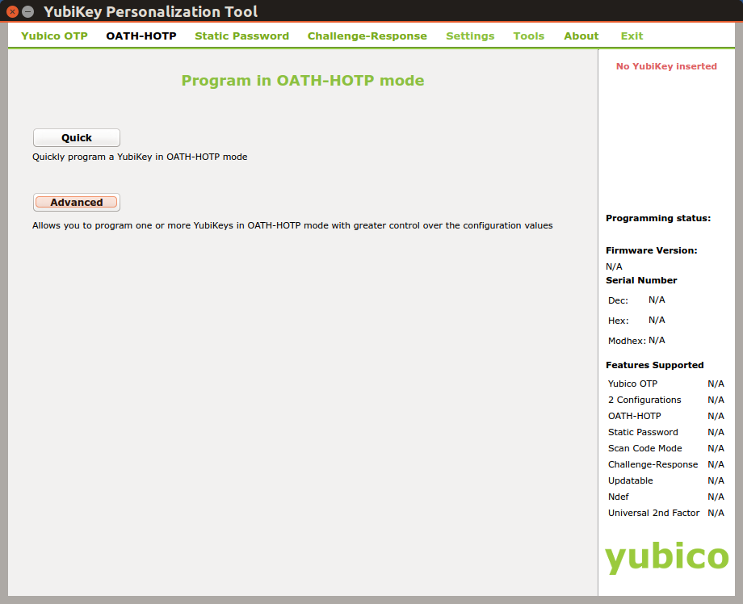

# StickLock
Using a YubiKey (or other USB security token) to unlock physical things.


## Introduction

While researching locks and lockable storage for a new premise I found lots of [LockPicking](https://en.wikipedia.org/wiki/Lock_picking) information about how to hack and break into products from even renowned companies. It's not only a waste of money buying "high security" products which could be unlocked by just a paper clip like shown in [this Video](https://www.youtube.com/watch?v=vIJFQO4DIxw) but might also be dangerous.

At the same time I use my YubiKey daily with IT systems and services. So I thought to myself:

***"Why not use a YubiKey as a key for physical storage/property?".***

So I started another research, if, how and with how much effort a lock for physical things could be designed which uses a standard USB security token as key.

Fortunately it was easy to design such a lock. The outcome is the "StickLock" (short "SL") described in this project.

## Design

### Goals

The design of the StickLock should meet the following goals:

* Easy to build

  It should be possible to build StickLock in less then an hour even for non technicians.

* Cheap

   No special, expensive, hard to get components.

* Verifiable

   Open-Source, verifiable by anyone interested in the inner workings.

* Multiple key support

  Support for at least three different USB security tokens.

* Multiple security

   StickLock should support multiple security technologies e.g. static keys, [HOTP](https://tools.ietf.org/html/rfc4226) etc.

* No complex user interface

   Only a blue, red and green LED and a button should be enough to operate StickLock.

* No need to be online

   StickLock does not need any internet connectivity.

* Electricity autonomous

   SL should be able to operate a long time from batteries.


### The Prototype

The prototype design uses cheap ready available components:

* a [Arduino UNO (or compatible)](https://store.arduino.cc/arduino-uno-smd-rev3)
* a [USB host shield](https://store.arduino.cc/arduino-usb-host-shield) or [compatible](https://www.circuitsathome.com/arduino_usb_host_shield_projects/) based on the [MAX3421E](https://www.maximintegrated.com/en/products/interface/controllers-expanders/MAX3421E.html)
* a [Pololu Pushbutton Power Switch](https://www.pololu.com/product/2812)
* a USB Security Token with HOTP and/or HID Keyboard (not FIDO HID!) support like a YubiKey [NEO, 4](https://www.yubico.com/products/yubikey-hardware/compare-yubikey-4-neo/#) or [5](https://www.yubico.com/product/yubikey-5-nfc/).
* some passive components like LED's, switches and resistors etc.

Total amount of all components is about 50.00 EUR.

The schematic shows that the StickLock is very easy to build.

[](./doc/StickLock-schematic.pdf)


## Usage

### Configuration

Before using StickLock, valid devices and keys must be configured. In normal operation SL does not provide any user interface via serial console (expect when explicitly enabled for testing and debugging - **NOT RECOMMENDED FOR NORMAL OPERATION**). To configure SL first enable the config flag in file `global.h`. Then modify `config.h` to match your devices and keys (details below). Flash your Arduino and you will see a menu displayed via serial console providing the following options:

```
StickLock 1.0.0 configuration mode ...

Usage:
h : shows this usage information
D : print configured devices
d : print EEPROM devices
K : print configured keys
k : print EEPROM keys
c : export devices & keys in EEPROM as C code
w : write configured devices and keys to EEPROM
X : erase EEPROM!!
E : show EEPROM hex dump
```

#### Supported Devices

As soon as an USB device is connected to SL its USB Vendor-ID (VID) and Product-ID (PID) are read. If SL is configured to only allow supported devices (**DEFAULT ENABLED, HIGHLY RECOMMENDED**) then these information is matched against SL configured device data. In case the connected device's VID and PID don't match, SL will stop to interact with it. This is indicated by a continuous blinking red LED until the device is disconnected from SL.

Supported devices are configured in `config.h` with their VID, PID and a short descriptive text like in the following example:
```c
const PROGMEM char device1_name[] = "YubiKey NEO NFC";
const PROGMEM char device2_name[] = "YubiKey 5 NFC";
const Device_t config_devices[] PROGMEM = {
    // VID     PID     Description
    {  0x1050, 0x0116, device1_name },
    {  0x1050, 0x0407, device2_name }
};
```
**NOTE**: It is possible to disable the supported devices check completely. In this case all USB HID devices will be accepted by SL. This can be done by uncommenting the line:
```c
// #define DISABLE_SUPPORTED_DEVICE_CHECKS
```
in file `global.h`. **THIS IS NOT RECOMMENDED!**

#### Keys

SL supports three different key types: HOTP-6, HOTP-8 and STATIC. They are configured in `config.h`. Each key has to be specified with its length (max 255 bytes) and its key bytes as described below.

For additional security a key can be combined with a device serial number. Most USB devices (not all) provide unique (some devices don't) serial number information. SL will only accept the key from a device with matching serial number. If a key is not bound to a serial number then any device can be used to provide the key.

```c
// Key 1 - 20 bytes long
static const uint8_t key1_length = 20;
const PROGMEM uint8_t key1[key1_length] = {
    0x30, 0x30, 0x30, 0x30, 0x30, 0x30, 0x30, 0x30, 0x30, 0x30,
    0x30, 0x30, 0x30, 0x30, 0x30, 0x30, 0x30, 0x30, 0x30, 0x30 };
static const uint8_t serial1_length = 10;
// Serial number for key 1 - 10 bytes long. Key will
// only be accepted from a device which provides
// this USB serial number.
const PROGMEM uint8_t serial1[serial1_length] = {
    0x30, 0x00, 0x30, 0x00, 0x30, 0x00, 0x34, 0x00, 0x38, 0x00 };

// Key 2 - 4 bytes long
static const uint8_t key2_length = 4;
const PROGMEM uint8_t key2[key2_length] = {
    0x74, 0x65, 0x73, 0x74 };
// No serial number information for Key 2. So
// this key will be accepted from any device.
static const uint8_t serial2_length = 0;
const PROGMEM uint8_t serial2[serial4_length] = {};
```
In `config.h` all configured keys and serial numbers are then combined into the key structure `config_keys` as shown below:
```c
// Note: when specifying counter values ensure they end with 'ULL'
// as counters are 'unsigned long long' 64 bit values
const Key_t config_keys[] PROGMEM = {
    // key 1
    { KFS_ENABLED | KFT_HMAC_OTP_LEN_8,
        serial1_length, serial1,
        key1_length, key1,
        100ULL, DEFAULT_COUNTER_TOLERANCE
    },
    // key 2
    { KFS_ENABLED | KFT_STATIC,
        serial2_length, serial2,
        key2_length, key2,
        COUNT_ZERO, 0
    }
};
```
An entry in `config_keys` is defined as:
```c
struct sKey {
    uint8_t state;
    uint8_t serial_len;
    uint8_t *serial_bytes;
    uint8_t key_len;
    uint8_t *key_bytes;
    ULL counter;
    uint8_t counter_tolerance;
};
```
**state**

Defines the state of a key entry and its key type.
```
+---+---+---+---+---+---+---+---+
| 7 | 6 | 5 | 4 | 3 | 2 | 1 | 0 | Bit
+---+---+---+---+---+---+---+---+

Bit
   0: Defines the state of the key
       0: Key is disabled an will not be used by SL
       1: Key will be used by SL
 2-1: Define the type of the key
      00: Static key
      01: HOTP key length 6
      10: HOTP key length 8
      11: unused
 7-3: unused
```

**serial_len**

Length in bytes of serial-number. 0-255 max.

**serial_bytes**

Serial-number bytes.

**key_len**

Length in bytes of key. 0-255 max.

**key_bytes**

Key bytes.

**counter**

Only used for HOTP keys. Defines the counter start value. Normally zero. Must match the counter value used by the HOTP USB token (e.g. a YubiKey NEO).

**counter_tolerance**

Defines how far the counters are allowed diverge. Normally 20.


#### Static Keys

Static keys are like password and the same recommendations apply to them. They should be sufficiently long and complex. Compatible YubiKeys can be used for up to 64 character keys. Even a standard USB Keyboard can be used to enter such a static key (although not recommended).

Key 2 in the samples above defines a static key with a length of four bytes. The byte values represent the ASCII string 'test'.

#### HOTP Keys

HOTP is defined in [RFC-4226](https://tools.ietf.org/html/rfc4226#section-5.4)

### Operation

StickLock indicates its state using a red, green and blue led:

|     Red      |  Green   | Blue |     Device     |  Action   |        Description         |
| ---- | ---- | ---- | -------------- | --------- | -------------------------- |
|  |  |  | -              | -         | No power                   |
|  |  |  | -              | -         | Power-on, normal mode, waiting for device to connect or for activity from connected device |
|  |  |  | -              | -         | Power-on, configuration mode active  |
|  |  |  | disconnected   | none      | Internal malfunction, StickLock not configured       |
|  |  |  | device connect | none      | Unsupported device connected |
|  |  |  | device connect | none      | Supported device connected, green LED blinks 4 times |
|  |  |  | connected      | key-press | Red LED on during USB HID keyboard activity, cleared when activity ends  |
|  |  |  | connected      | enter-key | After ENTER key was received, provided key is checked against all stored keys and no matching key could be found, blink red LED 10 times |
|  |  |  | connected      | enter-key | Provided key was positively matched against a stored key, light green LED for 3 sec. |

If SL operates on batteries first press SW1 (power) to turn on SL. Next an USB token can be inserted and (depending on the token) the unlock action can be performed - e.g. pressing the key on a YubiKey. Depending on supported device or valid key one of the above states is signalled using the LEDs as described above.

SL will power off itself via the used POLOLU switch after an idle timeout of 1 minute or 10 seconds after a success full unlock action or the removal of a token.

SL does not include any form of mechanical actuators to perform the actual unlock actions as this depends highly on where SL will be used. Instead SL signals via J3 (SUP) and J4 (UNL) when a supported device is inserted* and when a valid key is detected.

**Note**: When supported device checks are disabled (**NOT RECOMENDED**) this signal will always be high.

Signals SUP and UNL should be routed via different paths to actuators for additional security. Also unlock action should only be performed when both signals are high.

SL contains an additional security feature - the clear switch. Pressing SW2 (clear) for more than 6 seconds **CLEARS ALL CONFIGURED KEYS**. From that moment on SL will not accept any USB device.

**Note**: If you use the clear feature be sure to have some other option to unlock like an additional physical lock etc. **THIS FEATURE COULD BE DANGEROUS!**

#### Example 1: YubiKey NEO static key

Start the YubiKey Personalization Tool and select `Static Password` and then `Advanced`.


To create a 64 character static key set `Password Length` to `64`. Then click a few times on the `Generate` button of each `Public Identity`, `Private Identity` and `Secret Key`. Check `Upper and lower case` and `Alphanumeric` checkboxes to ensure that the key will include uppercase, lowercase and numbers. Deselect `Send ! as prefix` as a leading '!' is not needed for the key.

Select the configuration slot (1 for short key press and 2 for long key press on YubiKey NEO) you want to use for this key and click `Write Configuration`.


Close the personalization tool and open a text editor or word processor. Press the button on the YubiKey (long or short depending on the selected configuration slot above) and see how the YubiKey types the key into the text editor or word processor.
This key needs to be converted into hex values which can then be used as `key_bytes` in `config.h`.
On linux this can be done with the command:
```shell
echo -n "this-is-the-key-string" | od -A n -t x1
```
Windows users can use the `certutil` utility. Save the key to a text file (e.g. key.txt) then use `certutil` to convert this text file to hex:
```bat
certutil -f -decodehex key.txt key-hex.txt
```

#### Example 2: YubiKey NEO HOTP key

Select `OATH-HOTP` in the YubiKey Personalization tool.



Don't use an OATH Token Identifier, select 6 or 8 digits for the HOTP length and press a few times generate to generate the random secret key.  `Moving factor seed` specifies the counter with which to start. To start with a counter of 0 specify `Fixed zero`.


The length, counter and key bytes are then configured using `config.h` as described above.

## Known problems and limitations

### Configuration

SL is not very easy to configure as the used Arduino provides not enough resources to implement full reconfiguration functions. But I think this is not really a problem as missing configuration functions when running in lock mode provide less attack surface.

### Performance

SL can handle multiple keys (as long as flash is available). When a key is provided by an USB token all keys are searched linearly in order as they are configured in `config.h`. This means it takes longer for SL to validate a key the farther away from the flash start it is located. Also a large counter tolerance for HOTP keys slows down verification process as the number of tolerable keys must each be calculated. Practice tests have shown that ~5 HOTP8 keys (YubiKeys configured with slot 1) provide good results width about 1 sec to unlock.

### Memory consumption

Enabling additional options in `global.h` like serial user interface or debugging output not only providers more attack surface but also reduces available memory resources significantly. These options are normally not used for standard operation. Ensure that after compiling at least 730 bytes are available for local variables (shown in console output). Otherwise you might notice wrong behaviour (e.g. long 64 byte static keys might no longer be recognized). Below 700 bytes no key type will work!

## License

StickLock is copyright by Richard Prinz <richard.prinz@min.at>, 2019 under [GNU GPL3](https://www.gnu.org/licenses/gpl-3.0.html) license.
